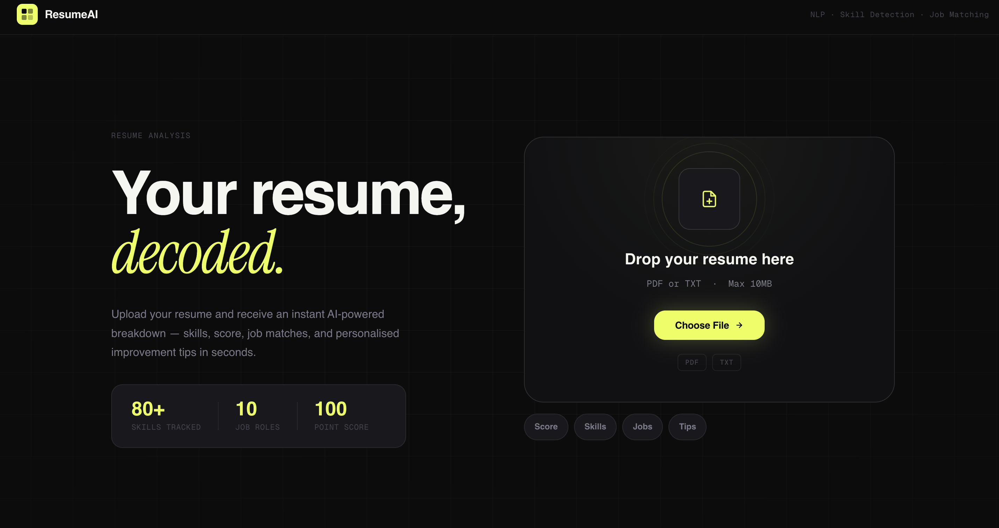
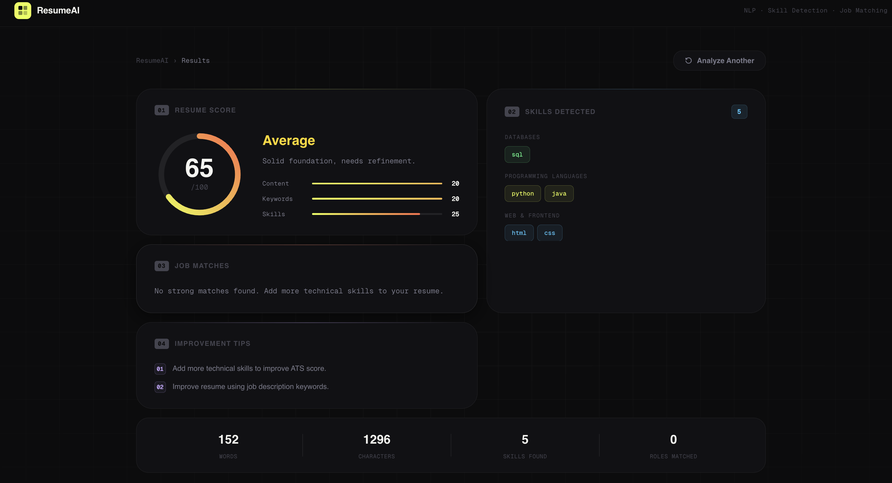

Resume Analyzer

An AI-powered web application that analyzes resumes and provides a complete breakdown including:

* Resume Score (0–100)
* kill Detection (categorized)
* Job Role Matching (% based)
* Personalized Improvement Tips
* Beautiful interactive dashboard

Backend

* Python
* Flask
* PyPDF2 / pdfplumber (PDF parsing)
* pytesseract (OCR for scanned PDFs)

Frontend

* HTML5 (Jinja templates)
* CSS3 (modern UI design)
* JavaScript (animations + API handling)

Project Structure

```
resume-analyzer/
│
├── app.py
├── README.md
│
├── templates/
│     └── index.html
│
├── static/
│     ├── style.css
│     └── script.js
```

Installation & Setup

Clone the repository

```bash
git clone https://github.com/your-username/resume-analyzer.git
cd resume-analyzer
```

2️⃣ Install dependencies

```bash
pip install flask pytesseract pdf2image PyPDF2 pdfplumber pillow
```


For Windows, add in `app.py`:

```python
pytesseract.pytesseract.tesseract_cmd = r"C:\Program Files\Tesseract-OCR\tesseract.exe"
```

Run the application

```bash
python app.py
```

5️⃣ Open in browser

```
http://127.0.0.1:5000
```


1. Upload resume (PDF/TXT)
2. Text is extracted (OCR if needed)
3. Skills are detected using pattern matching
4. Resume score is calculated based on:

   * Skills
   * Content quality
   * Keywords
5. Job roles are matched
6. Dashboard displays:

   * Score animation
   * Skills
   * Job matches
   * Tips


Use Cases

* Students preparing for placements
* Job seekers improving resumes
* Developers building AI projects

  


